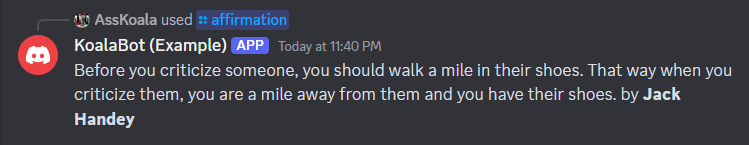

# KoalaBot

Simple, turnkey discord bot to do various stuff that was once handled by IRC bots but also does other, new things good too.

The bot is made to be extensible by using the API functionality to do pretty much whatever you want for slash commands.  There's probably a lot of stuff you can't do, but what you _can_ do can be done really well.

## Running using Docker
- Install Docker Engine: https://docs.docker.com/engine/install/
- Create basic env file with required settings (see below).
- Copy [Example compose.yml](buildsys/docker/compose.yml) somewhere locally.
- Modify the compose.yml to meet your specific needs.  See docker compose documentation: https://docs.docker.com/compose/
- Run bot: ```docker compose -f compose.yml up -d```

### Adding custom commands
See [api folder](src/api) for API documentation.

- Choose a release number you like (semantic versioning is api.major.patch, all releases with the same api guarantee api compatibility)
- Modify your docker compose with the new file, e.g. 
```
volumes:
  - ~/myCommands/myNewCommand.js:/bot/build/commands/myNewCommand.js
```

## .env configuration
All bot features can be enabled and setup through the .env file, no code necessary unless adding custom commands or listeners (see api folder).

Every user-configurable setting used by the bot is listed at the end.

At a **minimum**, your .env file must define every required parameter without a default from Global Settings and Discord Settings, listed in the details below.

Additionally, you **must** attain a bot token and place it in the appropriate variable in the .env file.  [There are lots of instructions on the internet](https://letmegooglethat.com/?q=create+discord+bot+token) though the bot doesn't require much by way of privileges, but depends on commands in use.  No commands currently require admin.

<details>
<summary>All Discord Bot Settings</summary

###
#### Global settings

| Name | DefaultValue | Required | Description |
| ---- | ------------ | -------- | ----------- |
| BOT_NAME | KoalaBot | false | Name for the bot to use when referencing self |
| DEBUG_ENABLE | false | false | Set to true to enable debug functionality |
| COMMAND_PATH | ./commands | false | Path to commands folder allowing override. Don't mess with this if you don't know what you're doing. |
| COMMAND_LIST | settings,coinflip,diceroll,leaderboard | false | Comma separate list of commands to load.  All commands are expected to be in the COMMAND_PATH folder and implement the DiscordBotCommand interface.  DEVELOPER DETAILS: Commands are dynamically imported so long as they register their name in .env and the command file itself has a registerDiscordBotCommand call to assign an instance to a given command. |
| DATA_PATH | ./data | true | Path to JSON data to be loaded by commands |
| TEMP_PATH | ./temp | true | Path to write temporary files |
| SCRIPT_PATH | ./scripts | false | Path to load external scripts from |
| REBOOT_FILE | $TEMP_PATH/reboot | false | Path to file to write to signal a reboot to the OS |
| LOG_MAX_ENTRIES | 2048 | false | Maximum number of log entries to keep in memory |
| LOG_PATH | ./logs | false | Folder to write logs to |
| FULL_LOG_FILENAME | bot.log | false | Log file to write ALL logs to |
| MESSAGE_LOG_FILENAME | discord_messages.log | false | Log file to write discord messages to |
| LOG_LEVEL | debug | false | Logging level.  See logger.ts enum LogLevel for available levels. |
| LISTENER_LIST | loglistener,deletebotmessagereactionlistener | false | List of listener modules to load |
#### reddit settings

| Name | DefaultValue | Required | Description |
| ---- | ------------ | -------- | ----------- |
| PYTHON_BINARY | python | false | Path to python binary |
| REDDIT_READER_SCRIPT_NAME | reddit_reader.py | false | Path to reddit reader python program (relative to SCRIPTS_PATH) |
| REDDIT_CLIENT_ID |  | true | Reddit app client id: https://www.reddit.com/prefs/apps |
| REDDIT_CLIENT_SECRET |  | true | Reddit app client secret: https://www.reddit.com/prefs/apps |
| REDDIT_USER_AGENT |  | true | Reddit custom user agent for use in praw |
#### image settings
| Name | DefaultValue | Required | Description |
| ---- | ------------ | -------- | ----------- |
| IMAGE_ENABLED_AI_LIST | stablediffusion,dalle,getimg.ai-flux | false | Comma separate list of AI image generation models to use slash commands with (requires reloading guild commands when changing this value). Default is all available, so remove any AI services you don't have an API key for (or just don't want to use). |

#### openai settings

| Name | DefaultValue | Required | Description |
| ---- | ------------ | -------- | ----------- |
| OPENAI_API_KEY |  | true | OpenAI API key to access data |
#### getimgai settings

| Name | DefaultValue | Required | Description |
| ---- | ------------ | -------- | ----------- |
| GETIMG_AI_API_KEY |  | true | getimg.ai API key to access data |
#### StableDiffusion web-ui settings
| Name | DefaultValue | Required | Description |
| ---- | ------------ | -------- | ----------- |
| SD_WEBUI_ADDRESS | 127.0.0.0:7860 | true | host:port needed to access the SD webui |
| SD_CHECKPOINTS | deliberate(Deliberate_v6.safetensors) | true | Command separate list of displayName(on-disk-name) checkpoints for use in calls to the SD web-ui.  If an (on-disk-name) is not provided, it will be generated by appending .safetensors to the displayName.  E.g. a value of "deliberate_v6" will result in attempting to use deliberate_v6.safetensors from disk |

#### chat settings

| Name | DefaultValue | Required | Description |
| ---- | ------------ | -------- | ----------- |
| GPT_TOKEN_COUNT | 8192 | false | Max number of tokens to send during chat command |
| GPT_MAX_MESSAGES | 2048 | false | Max number of message history to send during chat command |
#### weather settings

| Name | DefaultValue | Required | Description |
| ---- | ------------ | -------- | ----------- |
| GOOGLE_MAPS_API_KEY |  | true | Google maps API key.  See https://developers.google.com/maps/documentation/javascript/get-api-key |
| OPEN_WEATHER_KEY |  | true | Open weather API key for the weather module.  See https://openweathermap.org/appid to get yourself going. |
#### discord settings

| Name | DefaultValue | Required | Description |
| ---- | ------------ | -------- | ----------- |
| DISCORD_TOKEN |  | true | Discord bot token.  You only need a single token if you don't want to setup a test environment for the bot (i.e. you just wanna use this with what it comes with) |
| DISCORD_APP_ID |  | true | Discord app id for bot, see discord docs |
| DISCORD_GUILD_ID |  | true | Comma separate list of guilds the bot will join.  e.g. DISCORD_GUILD_ID="12345" is a single server. DISCORD_GUILD_ID="12345,67891" for two servers and so on. |
| DISCORD_CLEAR_SLASH_COMMANDS |  | true | Clear slash commands on startup, recommend true for production use. |
| DISCORD_DEPLOY_GUILD_SLASH_COMMANDS |  | true | Deploy slash commands to guilds, recommend true for production use |
| DISCORD_DEPLOY_GLOBAL_SLASH_COMMANDS | false | false | Deploy slash commands globally for bot, recommend to always be false |

</details>

## High level program flow

### Bot

bot.js contains all the discord bot code.

On startup, the env file is loaded and the modules are read in.  These then dynamically register themselves based on what the .env file says should be loaded.

Each module is passed in the discord interaction when discord sends a matching command.  Each command implements their own functionality independent of any other, though shared functionality (e.g. user settings) can be accessed via the instance object passed into the handler.

## Available Commands

Commands must be enabled by adding the (lower case) command name to the command list variable in the .env file.

E.g. to enable the affirmation and chat commands only in the .env:
```COMMAND_LIST="affirmation,chat"```

<details>
<summary>Affirmation</summary>



Return the user a random affirmation when calling the /affirmation slash command.  
  
Affirmations must be in $DATA_PATH/affirmations.json

JSON is formatted as an array as follows:
```
[
{
  "author": "Jimmy Patterson",
  "entry": "The beatings will continue until morale improves."
},
{
  "author": "Napeloen",
  "entry": "A winter invasion sounds lovely."
}
]
```
</details>
<details>
<summary>Chat</summary>


  
Query ChatGPT using conversation history using /chat slash command.  This requires an [OpenAI API Key](https://help.openai.com/en/articles/4936850-where-do-i-find-my-openai-api-key).

Use this to ask the bot to summarize the channel conversation or that sort of thing.

There's nothing special to setup other than adding the API key and enabling the command via the env command list.  The bot will load logs on startup to repopulate the chat in-memory log that's sent to ChatGPT.
</details>
<details>
<summary>Coinflip</summary>


 
Adds /coinflip slash command
</details>
<details>
<summary>Diceroll</summary>


  
Adds /diceroll slash command
</details>
<details>
<summary>Dict</summary>


  
Adds /dict, /define, and /index slash commands.

This command creates/reads and updates $DATA_PATH/dictdata.json that holds random definitions from users.  /define defines a new entry, /dict looks up an entry, and /index searches entries for a given string.

Example JSON:
```
[
  {
    "author": "AssKoala",
    "entry": "cheese",
    "definition": "look, I love cheese"
  },
  {
    "author": "Swank",
    "entry": "swank on love",
    "definition": "I love AssKoala"
  }
]
```
</details>
<details>
<summary>Image</summary>


  
Adds /image slash command

Depending on what Image API's you want access to, you need to define different variables to the .env file.

Currently, the bot supports OpenAI's DALL-E API, Stable Diffusion through [stablediffusion-web-ui](https://github.com/AUTOMATIC1111/stable-diffusion-webui), and getimg.ai FLUX.  Appropriate .env parameters must be provided for given subcommands to actually work.
</details>
<details>
<summary>Leaderboard</summary>


  
Adds /leaderboard slash command.

Leaderboard command searches logs and generates a list of entries for a given search string/word.  Additionally, supports a "profanity" leaderboard that will display a number of uses leaderboard based on $DATA_PATH/profanity.json.

JSON matches support regex.

JSON is array of entries, e.g.
```
[
    {
        "profanity": "ass",
        "matches": [
            "^[a@][s\\$][s\\$]$",
            "[a@][s\\$][s\\$]h[o0][l1][e3][s\\$]?"
        ]
    },
    {
        "profanity": "pimpmobile",
        "matches": [
            "pimpmobile",
        ]
    }
]
```
</details>
<details>
<summary>Query</summary>


  
Adds /query slash command.  Sends a query to ChatGPT _without_ also sending chat logs.  Use this for random questions like "what is the meaning of life" or "where's waldo".

This requires an OpenAI API key.
</details>
<details>
<summary>Reddit</summary>


  
Adds slash commands based on the JSON in $DATA_PATH/redditlinks.json allowing pulling of top reddit links from subreddits defined in the channel. 

This requires [reddit API keys](https://www.reddit.com/r/reddit.com/wiki/api).

The following example JSON:
```
[
	{
		"name": "topredditlink,
		"count": 50,
		"description": "Retrieve a reddit link!",
		"subreddits": [
			"AskReddit",
			"announcements",
			"funny",
			"pics"
		],
		"whitelistedChannels": [
      "spam"
		],
		"blacklistedChannels": [
		]
	}
]
```
Creates a slash command /topredditlink that pulls 50 random top links between the listed subreddits based on a filter provided when using the command, but only allows the command to be used in channels named spam.

If "spam" was instead in the blacklist, it would be allowed in all channels _except_ channels named spam.
</details>
<details>
<summary>Settings</summary>


  
Adds /settings slash command.  This allows users to set preferred temperature unit preferences and location for use with other commands.

The file is saved in $DATA_PATH/settings.json
</details>
<details>
<summary>Vision</summary>


  
Adds /vision slash command that sends images to OpenAI ChatGPT vision processing allowing querying of what's in the image or other such stuff.

This requires OpenAI .env settings.
</details>
<details>
<summary>Weather</summary>


Adds /forecast and /weather slash commands to tell the weather based on location.  Requires .env API keys for location services and weather services as defined in the .env section.
</details>
